# Usage Guide

Server Price Tracker monitors eBay for server hardware deals. You define
**watches** (saved searches), and the system automatically polls eBay, extracts
structured attributes from listing titles via LLM, scores each listing against
historical price baselines, and sends deal alerts to Discord when scores exceed
your threshold.

This guide walks through the entire pipeline — from creating your first watch
to receiving deal alerts — with both HTTP API and `spt` CLI examples.

## Table of Contents

- [How It Works](#how-it-works)
- [Quick Start](#quick-start)
- [Watches](#watches)
  - [Create a Watch](#create-a-watch)
  - [List and Inspect Watches](#list-and-inspect-watches)
  - [Enable, Disable, and Delete](#enable-disable-and-delete)
- [Search](#search)
- [Ingestion](#ingestion)
- [Extraction](#extraction)
- [Baselines](#baselines)
- [Scoring](#scoring)
- [Listings](#listings)
  - [Browse Listings](#browse-listings)
  - [Inspect a Listing](#inspect-a-listing)
- [Rescoring](#rescoring)
- [Alerts and Notifications](#alerts-and-notifications)
- [Quota](#quota)
- [API Reference](#api-reference)
- [CLI Reference](#cli-reference)

## How It Works

The pipeline runs as a continuous loop. You create watches, the scheduler polls
eBay on a 15-minute interval, and each listing flows through extraction, scoring,
and alerting.


Each stage in detail:

| Stage | What happens |
|-------|-------------|
| **Watch** | Defines an eBay search query, component type, filters, and score threshold |
| **Ingestion** | Polls eBay for each enabled watch, respecting rate limits (5 req/s, 5000/day) |
| **Classification** | LLM classifies the listing title into a component type (ram, drive, server, cpu, nic) |
| **Extraction** | LLM extracts structured attributes (capacity, speed, ECC, etc.) from the title |
| **Product Key** | Normalizes attributes into a grouping key like `ram:ddr4:ecc_reg:32gb:2666` |
| **Scoring** | Computes a 0-100 composite score using price, seller, condition, quantity, quality, and time factors |
| **Alerting** | Fires a Discord webhook when the score meets or exceeds the watch threshold |

## Quick Start

Start the local development stack and the API server:

```bash
# Start PostgreSQL + Ollama, run migrations, pull the LLM model
make dev-setup

# Start the API server
make run
```

The API is now available at `http://localhost:8080`. You can explore it
interactively at `http://localhost:8080/docs` or fetch the OpenAPI spec at
`http://localhost:8080/openapi.json`.

The `spt` CLI talks to this server. Build it and confirm it connects:

```bash
make build-spt
./build/bin/spt watches list
```

## Watches

A watch is a saved search. It defines what to look for on eBay, what component
type to expect, optional filters to narrow results, and a score threshold that
controls when you get alerted.

### Create a Watch

Create a watch for DDR4 ECC server RAM priced between $20 and $80, alerting
when the deal score reaches 75 or above:

```bash
# CLI
spt watches create \
  --name "DDR4 ECC 32GB" \
  --query "DDR4 ECC 32GB RDIMM server memory" \
  --type ram \
  --threshold 75 \
  --filter "price_min=20" \
  --filter "price_max=80"
```

```bash
# HTTPie
http POST :8080/api/v1/watches \
  name="DDR4 ECC 32GB" \
  search_query="DDR4 ECC 32GB RDIMM server memory" \
  component_type=ram \
  score_threshold:=75 \
  filters:='{"price_min": 20, "price_max": 80}'
```

```bash
# curl
curl -s http://localhost:8080/api/v1/watches \
  -H "Content-Type: application/json" \
  -d '{
    "name": "DDR4 ECC 32GB",
    "search_query": "DDR4 ECC 32GB RDIMM server memory",
    "component_type": "ram",
    "score_threshold": 75,
    "filters": {
      "price_min": 20,
      "price_max": 80
    }
  }'
```

A more advanced example — watch for Dell R630 servers with specific seller and
attribute filters:

```bash
# CLI
spt watches create \
  --name "Dell R630 Deals" \
  --query "Dell PowerEdge R630" \
  --type server \
  --threshold 80 \
  --filter "price_min=100" \
  --filter "price_max=500" \
  --filter "seller_min_feedback=500" \
  --filter "conditions=used_working,like_new" \
  --filter "attr:form_factor=eq:1U"
```

```bash
# curl
curl -s http://localhost:8080/api/v1/watches \
  -H "Content-Type: application/json" \
  -d '{
    "name": "Dell R630 Deals",
    "search_query": "Dell PowerEdge R630",
    "component_type": "server",
    "score_threshold": 80,
    "filters": {
      "price_min": 100,
      "price_max": 500,
      "seller_min_feedback": 500,
      "conditions": ["used_working", "like_new"],
      "attribute_filters": {
        "form_factor": {"eq": "1U"}
      }
    }
  }'
```

#### Watch Filters Reference

Filters narrow which listings trigger alerts. They are evaluated after scoring —
a listing must both meet the score threshold and pass all filters.

| Filter | JSON field | CLI flag | Description |
|--------|-----------|----------|-------------|
| Price min | `price_min` | `--filter "price_min=20"` | Minimum unit price (price + shipping / quantity) |
| Price max | `price_max` | `--filter "price_max=80"` | Maximum unit price |
| Min feedback | `seller_min_feedback` | `--filter "seller_min_feedback=500"` | Seller feedback score minimum |
| Min feedback % | `seller_min_feedback_pct` | `--filter "seller_min_feedback_pct=98.5"` | Seller positive feedback percentage |
| Top rated only | `seller_top_rated_only` | `--filter "seller_top_rated_only=true"` | Only eBay Top Rated sellers |
| Conditions | `conditions` | `--filter "conditions=new,like_new"` | Allowed conditions (comma-separated) |
| Attribute exact | `attribute_filters.{key}.eq` | `--filter "attr:generation=eq:DDR4"` | Exact attribute match |
| Attribute min | `attribute_filters.{key}.min` | `--filter "attr:capacity_gb=min:32"` | Numeric attribute minimum |
| Attribute max | `attribute_filters.{key}.max` | `--filter "attr:speed_mhz=max:3200"` | Numeric attribute maximum |

### List and Inspect Watches

```bash
# List all watches
spt watches list
spt watches list --output json

# HTTPie
http :8080/api/v1/watches

# Filter to only enabled watches
http :8080/api/v1/watches enabled==true
```

```bash
# Get details for a specific watch
spt watches get <watch-id>

# HTTPie
http :8080/api/v1/watches/<watch-id>
```

### Enable, Disable, and Delete

```bash
# Disable a watch (stops polling, preserves existing listings)
spt watches disable <watch-id>

# HTTPie
http PUT :8080/api/v1/watches/<watch-id>/enabled enabled:=false

# curl
curl -s -X PUT http://localhost:8080/api/v1/watches/<watch-id>/enabled \
  -H "Content-Type: application/json" \
  -d '{"enabled": false}'
```

```bash
# Re-enable
spt watches enable <watch-id>

# Delete permanently
spt watches delete <watch-id>
```

## Search

Search eBay directly without creating a watch. This is useful for one-off
queries or to preview what a watch query would return before committing to it.

```bash
# CLI
spt search "DDR4 ECC 32GB RDIMM"
spt search "Dell PowerEdge R630" --limit 25
```

```bash
# HTTPie
http POST :8080/api/v1/search \
  query="DDR4 ECC 32GB RDIMM" \
  limit:=10

# curl
curl -s http://localhost:8080/api/v1/search \
  -H "Content-Type: application/json" \
  -d '{"query": "DDR4 ECC 32GB RDIMM", "limit": 10}'
```

The response includes raw eBay results converted to the internal listing format:

```json
{
  "listings": [
    {
      "ebay_item_id": "v1|123456789|0",
      "title": "Samsung 32GB DDR4-2666 PC4-21300 ECC RDIMM M393A4K40CB2-CTD",
      "price": 24.99,
      "currency": "USD",
      "seller_name": "server_parts_outlet",
      "seller_feedback_score": 15234,
      "seller_feedback_pct": 99.8,
      "seller_top_rated": true,
      "item_url": "https://www.ebay.com/itm/123456789",
      "image_url": "https://i.ebayimg.com/images/g/..."
    }
  ],
  "total": 487,
  "has_more": true
}
```

## Ingestion

Ingestion is the core pipeline. It polls eBay for every enabled watch, runs LLM
extraction on new listings, scores them, and fires alerts. It runs automatically
on a 15-minute schedule (staggered across watches), but you can trigger it
manually.

```bash
# CLI
spt ingest
```

```bash
# HTTPie
http POST :8080/api/v1/ingest

# curl
curl -s -X POST http://localhost:8080/api/v1/ingest
```



```mermaid
sequenceDiagram
    participant User
    participant API
    participant eBay
    participant LLM
    participant DB
    participant Discord

    User->>API: POST /api/v1/ingest
    API->>DB: Fetch enabled watches

    loop For each watch
        API->>eBay: Browse API search
        eBay-->>API: Listing results

        loop For each new listing
            API->>LLM: Classify component type
            LLM-->>API: "ram"
            API->>LLM: Extract attributes
            LLM-->>API: {capacity_gb: 32, generation: "DDR4", ...}
            API->>DB: Store listing + attributes
            API->>DB: Fetch baseline for product key
            API->>API: Compute score
            API->>DB: Store score

            alt Score >= threshold AND filters match
                API->>Discord: Send alert embed
            end
        end
    end

    API-->>User: {"status": "ingestion completed"}
```

During ingestion, the system enforces rate limits:

- **Token bucket**: 5 requests/second with a burst of 10
- **Daily quota**: 5,000 eBay API calls per rolling 24-hour window
- **Per-cycle cap**: 50 API calls per ingestion cycle (configurable)

## Extraction

Extraction is the two-pass LLM pipeline that turns an unstructured eBay listing
title into structured, queryable attributes. You can test it on individual
titles without running a full ingestion.

```bash
# CLI
spt extract "Samsung 32GB DDR4 2666MHz ECC REG M393A4K40CB2-CTD"
```

```bash
# HTTPie
http POST :8080/api/v1/extract \
  title="Samsung 32GB DDR4 2666MHz ECC REG M393A4K40CB2-CTD"

# curl
curl -s http://localhost:8080/api/v1/extract \
  -H "Content-Type: application/json" \
  -d '{"title": "Samsung 32GB DDR4 2666MHz ECC REG M393A4K40CB2-CTD"}'
```

Response:

```json
{
  "component_type": "ram",
  "attributes": {
    "manufacturer": "Samsung",
    "part_number": "M393A4K40CB2-CTD",
    "capacity_gb": 32,
    "generation": "DDR4",
    "speed_mhz": 2666,
    "ecc": true,
    "registered": true,
    "condition": "unknown",
    "confidence": 0.95
  },
  "product_key": "ram:ddr4:ecc_reg:32gb:2666"
}
```

### How Extraction Works

**Pass 1 — Classification.** The LLM reads the title and returns one of six
component types: `ram`, `drive`, `server`, `cpu`, `nic`, or `other`.

**Pass 2 — Attribute extraction.** Using the classified type, the LLM receives
a component-specific prompt and returns structured JSON with the relevant
attributes (e.g., capacity, speed, ECC for RAM; interface, form factor, RPM for
drives).

### Product Keys

After extraction, attributes are normalized into a **product key** that groups
similar items for baseline pricing. The format varies by component type:

| Type | Format | Example |
|------|--------|---------|
| RAM | `ram:{generation}:{type}:{capacity}:{speed}` | `ram:ddr4:ecc_reg:32gb:2666` |
| Drive | `drive:{interface}:{form_factor}:{capacity}:{kind}` | `drive:sas:2.5:600gb:10k` |
| Server | `server:{manufacturer}:{model}:{drive_ff}` | `server:dell:poweredge_r630:2.5` |
| CPU | `cpu:{manufacturer}:{family}:{model}` | `cpu:intel:xeon:e5-2680_v4` |
| NIC | `nic:{speed}:{ports}:{port_type}` | `nic:25gbe:2p:sfp28` |

### Supported LLM Backends

| Backend | Config key | Notes |
|---------|-----------|-------|
| Ollama | `ollama` | Local inference, supports grammar enforcement. Default. |
| Anthropic Claude | `anthropic` | Cloud API, requires `ANTHROPIC_API_KEY` |
| OpenAI-compatible | `openai_compat` | Any endpoint implementing the OpenAI chat API |

## Baselines

Price baselines aggregate historical listing data by product key. They compute
percentiles (P10, P25, P50, P75, P90) and mean price from the last 90 days of
data. The scoring engine uses these percentiles to determine whether a listing
is priced above or below market.

Baselines are recomputed automatically every 6 hours. You can also trigger a
manual refresh.

```bash
# Refresh baselines
spt baselines refresh

# HTTPie
http POST :8080/api/v1/baselines/refresh

# curl
curl -s -X POST http://localhost:8080/api/v1/baselines/refresh
```

```bash
# List all baselines
spt baselines list
```

```bash
# Get baseline for a specific product key
spt baselines get "ram:ddr4:ecc_reg:32gb:2666"

# HTTPie
http :8080/api/v1/baselines/ram:ddr4:ecc_reg:32gb:2666
```

Example baseline response:

```json
{
  "id": "a1b2c3d4-...",
  "product_key": "ram:ddr4:ecc_reg:32gb:2666",
  "sample_count": 47,
  "p10": 18.50,
  "p25": 22.00,
  "p50": 28.99,
  "p75": 35.00,
  "p90": 45.00,
  "mean": 29.47,
  "updated_at": "2026-02-17T12:00:00Z"
}
```

A baseline needs at least 10 samples to be used for price scoring. Below that
threshold, the price factor defaults to 50 (neutral) so new product categories
don't produce misleading scores.

## Scoring

Every listing receives a composite score from 0 to 100. Higher scores indicate
better deals. The score is a weighted sum of six factors:


### Score Factors

**Price (40%)** — How the listing's unit price compares to the baseline for its
product key. A listing at or below the 10th percentile scores 100; at the 90th
percentile or above scores 0. Linear interpolation between percentile
boundaries. If the baseline has fewer than 10 samples, the price score defaults
to 50.

| Unit price vs baseline | Price score |
|----------------------|-------------|
| <= P10 | 100 |
| P10 - P25 | 85 - 100 |
| P25 - P50 | 50 - 85 |
| P50 - P75 | 25 - 50 |
| P75 - P90 | 0 - 25 |
| > P90 | 0 |

**Seller (20%)** — Based on feedback score, positive feedback percentage, and
Top Rated status. A seller with 5000+ feedback, 99.5%+ positive, and Top Rated
badge scores 100.

**Condition (15%)** — Maps the normalized condition to a fixed score: New (100),
Like New (90), Used Working (70), Unknown (40), For Parts (10).

**Quantity (10%)** — Bulk lots score higher. Single items score 50 (neutral),
lots of 16+ score 90.

**Quality (10%)** — Based on listing completeness: images, item specifics,
description length.

**Time (5%)** — Urgency bonus for auctions ending within an hour (100) or newly
listed Buy It Now items (80).

### Score Breakdown

Each listing stores a full breakdown alongside the composite score:

```json
{
  "score": 82,
  "score_breakdown": {
    "price": 90,
    "seller": 85,
    "condition": 70,
    "quantity": 50,
    "quality": 80,
    "time": 30,
    "total": 82
  }
}
```

## Listings

Once listings have been ingested and scored, you can query them with filters,
sorting, and pagination.

### Browse Listings

```bash
# List all listings (default: 50 results)
spt listings list

# Filter by component type and minimum score
spt listings list --type ram --min-score 70

# Sort by price, paginate
spt listings list --order-by price --limit 20 --offset 40

# Filter by product key
spt listings list --product-key "ram:ddr4:ecc_reg:32gb:2666"

# JSON output
spt listings list --type ram --min-score 80 --output json
```

```bash
# HTTPie
http :8080/api/v1/listings \
  component_type==ram \
  min_score==70 \
  order_by==score \
  limit==20

# curl
curl -s "http://localhost:8080/api/v1/listings?component_type=ram&min_score=70&order_by=score&limit=20"
```

Response:

```json
{
  "listings": [
    {
      "id": "f47ac10b-...",
      "title": "Samsung 32GB DDR4-2666 ECC RDIMM M393A4K40CB2-CTD",
      "price": 22.99,
      "currency": "USD",
      "component_type": "ram",
      "product_key": "ram:ddr4:ecc_reg:32gb:2666",
      "score": 87,
      "score_breakdown": {
        "price": 95,
        "seller": 85,
        "condition": 70,
        "quantity": 50,
        "quality": 80,
        "time": 30,
        "total": 87
      },
      "seller_name": "server_parts_outlet",
      "seller_feedback_score": 15234,
      "condition_norm": "used_working",
      "item_url": "https://www.ebay.com/itm/123456789"
    }
  ],
  "total": 142,
  "limit": 20,
  "offset": 0
}
```

#### Query Parameters

| Parameter | Type | Default | Description |
|-----------|------|---------|-------------|
| `component_type` | enum | — | `ram`, `drive`, `server`, `cpu`, `nic`, `other` |
| `product_key` | string | — | Exact product key match |
| `min_score` | int | 0 | Minimum composite score (0-100) |
| `max_score` | int | 0 | Maximum composite score (0-100, 0 = no limit) |
| `limit` | int | 50 | Results per page (1-1000) |
| `offset` | int | 0 | Pagination offset |
| `order_by` | enum | — | `score`, `price`, `first_seen_at` |

### Inspect a Listing

```bash
# CLI
spt listings get <listing-id>

# HTTPie
http :8080/api/v1/listings/<listing-id>
```

This returns the full listing with all extracted attributes, score breakdown,
seller details, and timestamps.

## Rescoring

When baselines are refreshed or scoring weights change, you can rescore all
existing listings against the updated data.

```bash
# CLI
spt rescore

# HTTPie
http POST :8080/api/v1/rescore

# curl
curl -s -X POST http://localhost:8080/api/v1/rescore
```

Response:

```json
{
  "scored": 1847
}
```

## Alerts and Notifications

When a listing's score meets or exceeds a watch's threshold and passes its
filters, an alert fires. Alerts are sent as Discord webhook embeds.


### Discord Embed Format

Each alert appears as a rich embed in your Discord channel:

- **Title**: Listing title (links to eBay)
- **Thumbnail**: Product image
- **Fields**: Score, Price, Unit Price, Seller, Condition, Component Type
- **Color**: Green (90+), Yellow (80-89), Orange (75-79)

When multiple alerts fire in a single ingestion cycle for the same watch, they
are batched into a single Discord message (up to 10 embeds per message).

### Configuration

Set `DISCORD_WEBHOOK_URL` in your `.env` file or in the config YAML:

```yaml
notifications:
  discord:
    enabled: true
    webhook_url: "${DISCORD_WEBHOOK_URL}"
```

## Quota

Monitor your eBay API usage to stay within the daily limit:

```bash
# HTTPie
http :8080/api/v1/quota

# curl
curl -s http://localhost:8080/api/v1/quota
```

Response:

```json
{
  "daily_limit": 5000,
  "daily_used": 142,
  "remaining": 4858,
  "reset_at": "2026-02-18T14:30:00Z"
}
```

The rate limiter enforces a rolling 24-hour window. If you hit the daily limit,
ingestion pauses until the window resets.

## API Reference

The API server generates an OpenAPI 3.1 spec at runtime. Access it at:

- **Interactive docs**: `http://localhost:8080/docs`
- **OpenAPI JSON**: `http://localhost:8080/openapi.json`

### Endpoint Summary

| Method | Path | Description |
|--------|------|-------------|
| `GET` | `/healthz` | Liveness probe |
| `GET` | `/readyz` | Readiness probe (checks database) |
| `GET` | `/metrics` | Prometheus metrics |
| `GET` | `/api/v1/watches` | List watches |
| `GET` | `/api/v1/watches/{id}` | Get watch |
| `POST` | `/api/v1/watches` | Create watch |
| `PUT` | `/api/v1/watches/{id}` | Update watch |
| `PUT` | `/api/v1/watches/{id}/enabled` | Enable/disable watch |
| `DELETE` | `/api/v1/watches/{id}` | Delete watch |
| `GET` | `/api/v1/listings` | List listings with filters |
| `GET` | `/api/v1/listings/{id}` | Get listing |
| `POST` | `/api/v1/search` | Search eBay |
| `POST` | `/api/v1/extract` | Extract attributes from title |
| `POST` | `/api/v1/ingest` | Trigger ingestion |
| `POST` | `/api/v1/baselines/refresh` | Refresh baselines |
| `GET` | `/api/v1/baselines` | List baselines |
| `GET` | `/api/v1/baselines/{product_key}` | Get baseline |
| `POST` | `/api/v1/rescore` | Rescore all listings |
| `GET` | `/api/v1/quota` | eBay API quota status |

## CLI Reference

The `spt` CLI is a remote client to the API server. All commands accept global
flags:

| Flag | Default | Description |
|------|---------|-------------|
| `--server` | `http://localhost:8080` | API server URL |
| `--output` | `table` | Output format (`table` or `json`) |
| `--config` | `$HOME/.spt.yaml` | Config file path |

Full command reference with examples is available in the generated
[CLI docs](docs/cli/spt.md).
