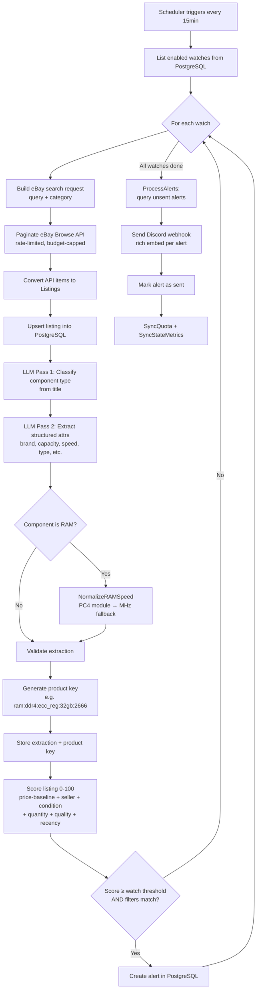

# Server Price Tracker

Server Price Tracker is an API-first Go service that monitors eBay for server hardware deals across five component types: RAM, drives, servers, CPUs, and NICs. Users define "watches" — saved searches with filters and score thresholds — and the system automatically polls the eBay Browse API on a 15-minute schedule, ingesting new listings into PostgreSQL. Each listing title is passed through a two-pass LLM extraction pipeline (classify component type, then extract structured attributes like DDR generation, capacity, speed, ECC type) using Ollama, Anthropic Claude, or any OpenAI-compatible backend. A post-extraction normalization layer recovers attributes the LLM misses — for example, converting PC4 module numbers in titles (like "PC4-21300") to MHz speeds (2666). The extracted attributes generate a canonical product key (e.g., `ram:ddr4:ecc_reg:32gb:2666`) used to group listings for price baseline computation.

Once a listing has a product key, it is scored on a weighted 0–100 composite scale factoring in price relative to baseline (40%), seller reputation (20%), condition (15%), quantity (10%), extraction quality (10%), and listing recency (5%). When a listing's score meets or exceeds a watch's threshold and passes its filters, an alert is created and dispatched as a rich embed via Discord webhook. The system exposes a full REST API with Huma v2 typed handlers, a `spt` CLI client for managing watches, browsing listings, triggering ingestion, and running re-extraction jobs, plus Prometheus metrics for Grafana dashboards covering ingestion rates, API quota usage, baseline maturity, scoring distributions, and extraction quality. It deploys to Kubernetes via Helm or Kustomize with ArgoCD GitOps.

---

## System Architecture

```
┌─────────────────────────────────────────────────────────────────────────┐
│                          Kubernetes Cluster                             │
│                                                                         │
│  ┌──────────────────────┐    ┌──────────────────┐    ┌───────────────┐  │
│  │  server-price-tracker │───▶│   PostgreSQL     │    │    Ollama     │  │
│  │  (Go API + Scheduler)│◀───│   (CNPG)         │    │  (LLM - GPU) │  │
│  │                      │───▶│                  │    │              │  │
│  │  :8080               │    └──────────────────┘    └──────▲───────┘  │
│  └──┬────┬────┬────┬────┘                                   │          │
│     │    │    │    │                                         │          │
│     │    │    │    └─────────── LLM Extraction ──────────────┘          │
│     │    │    │                                                         │
│     │    │    └──────────────┐                                          │
│     │    │                   ▼                                          │
│     │    │         ┌──────────────────┐                                 │
│     │    │         │  Discord Webhook │                                 │
│     │    │         │  (Notifications) │                                 │
│     │    │         └──────────────────┘                                 │
│     │    │                                                              │
│     │    └──────┐                                                       │
│     │           ▼                                                       │
│     │  ┌─────────────────┐    ┌──────────────────┐                      │
│     │  │   Prometheus    │───▶│     Grafana      │                      │
│     │  │   (Metrics)     │    │   (Dashboards)   │                      │
│     │  └─────────────────┘    └──────────────────┘                      │
│     │                                                                   │
│     └──────────────────────┐                                            │
│                            ▼                                            │
│                   ┌─────────────────┐                                   │
│                   │  Cilium Gateway  │◀──── spt CLI / Browser           │
│                   │  (Ingress)       │                                   │
│                   └─────────────────┘                                   │
└─────────────────────────────────────────────────────────────────────────┘

            External:
            ┌──────────────────┐
            │  eBay Browse API │  (polled every 15min per watch)
            │  eBay Analytics  │  (quota sync after each cycle)
            └──────────────────┘
```

---

## Workflow: eBay Listing to Discord Notification (Mermaid)



---

## Workflow: eBay Listing to Discord Notification (ASCII)

```
  ┌─────────────┐
  │  Scheduler   │  (every 15 min)
  └──────┬───────┘
         ▼
  ┌─────────────────────────┐
  │ List enabled watches    │◀── PostgreSQL
  └──────┬──────────────────┘
         ▼
  ┌─────────────────────────┐
  │ For each watch:         │
  │                         │
  │  ┌────────────────────┐ │
  │  │ Search eBay API    │ │──▶ eBay Browse API (paginated, rate-limited)
  │  └────────┬───────────┘ │
  │           ▼             │
  │  ┌────────────────────┐ │
  │  │ Upsert listings    │ │──▶ PostgreSQL
  │  └────────┬───────────┘ │
  │           ▼             │
  │  ┌────────────────────┐ │
  │  │ LLM Extraction     │ │──▶ Ollama / Claude / OpenAI-compat
  │  │  1. Classify type  │ │
  │  │  2. Extract attrs  │ │
  │  │  3. Normalize RAM  │ │    (PC4-21300 → 2666 MHz)
  │  └────────┬───────────┘ │
  │           ▼             │
  │  ┌────────────────────┐ │
  │  │ Generate product   │ │    ram:ddr4:ecc_reg:32gb:2666
  │  │ key + store        │ │──▶ PostgreSQL
  │  └────────┬───────────┘ │
  │           ▼             │
  │  ┌────────────────────┐ │
  │  │ Score listing      │ │    0-100 composite
  │  │  price vs baseline │ │◀── PostgreSQL (price_baselines)
  │  │  + seller/cond/qty │ │
  │  └────────┬───────────┘ │
  │           ▼             │
  │  ┌────────────────────┐ │
  │  │ Score ≥ threshold  │ │
  │  │ AND filters match? │ │
  │  └───┬────────┬───────┘ │
  │   No │     Yes│         │
  │      │        ▼         │
  │      │  ┌────────────┐  │
  │      │  │Create alert│  │──▶ PostgreSQL (alerts)
  │      │  └────────────┘  │
  │      │                  │
  └──────┼──────────────────┘
         ▼
  ┌─────────────────────────┐
  │ Process unsent alerts   │◀── PostgreSQL
  └──────┬──────────────────┘
         ▼
  ┌─────────────────────────┐
  │ Send Discord webhook    │──▶ Discord (rich embed)
  │ Mark alert as sent      │──▶ PostgreSQL
  └──────┬──────────────────┘
         ▼
  ┌─────────────────────────┐
  │ Sync quota + metrics    │──▶ eBay Analytics API / Prometheus
  └─────────────────────────┘
```
